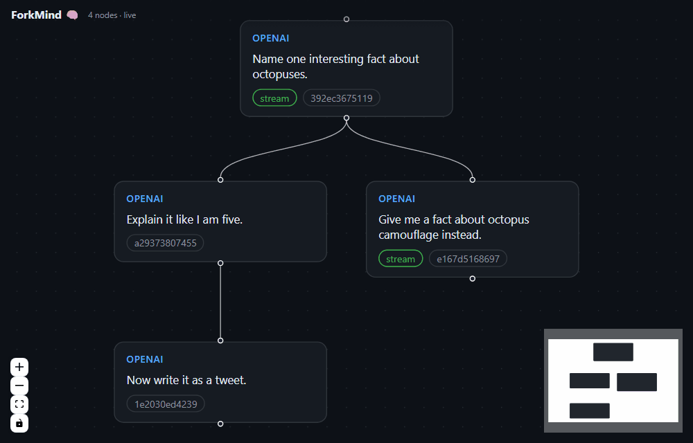
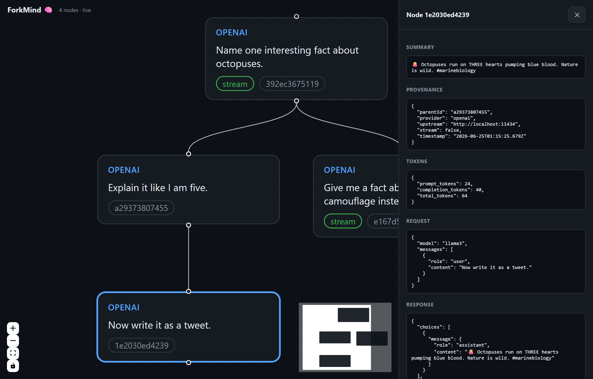

# ForkMind 🧠

[](./LICENSE)
[](https://github.com/medhovarsh/forkmind/actions/workflows/ci.yml)
[](https://nodejs.org)
[](./CONTRIBUTING.md)
[](./CONTRIBUTING.md)
[](https://github.com/Medhovarsh/forkmind/graphs/contributors)
[](https://medhovarsh.github.io/forkmind/)

**Local-first LLM state branching & debugging.** ForkMind treats AI context
windows like a Git repository: it captures every LLM call into a local
`.forkmind/` directory, visualizes the conversation as a Directed Acyclic Graph
(DAG), and lets you **branch** alternative prompts or model params from any point
in the history — all on your machine, no cloud, no account.

Works with **any OpenAI-compatible API**, defaulting to **free, open-source
models** via [Ollama](https://ollama.com). Also supports Anthropic and any
hosted free tier (Groq, OpenRouter, Together, vLLM, LM Studio).



> Live demo: a conversation tree with a branch off the root, the node inspector
> (request/response, tokens, provenance), and the **Fork from here** dialog.

<details>
<summary>Static screenshot</summary>



</details>

---

## Why

Debugging agentic / tool-calling flows means re-running the same prompt with
tiny tweaks over and over. ForkMind records each run as a node, so you can:

- **See** the whole conversation tree, including tool calls and token usage.
- **Branch** from any historical turn — edit the prompt, swap the model, re-run.
- **Compare** outcomes visually instead of scrolling through terminal logs.

Everything is plain JSON on disk. No database. No telemetry.

---

## Install

```bash
# Run without installing (once published to npm)
npx forkmind init
npx forkmind start

# …or install the CLI globally
npm install -g forkmind
forkmind start
```

No npm registry needed either — ForkMind runs straight from the git link, and
the dashboard builds automatically on install:

```bash
# Run without installing, from GitHub
npx github:medhovarsh/forkmind init
npx github:medhovarsh/forkmind start

# …or clone to hack on it
git clone https://github.com/medhovarsh/forkmind
cd forkmind && npm install
```

### Install as a Claude Code plugin

ForkMind ships a Claude Code plugin (skill + `/forkmind` command) so Claude knows
when and how to drive it — same install flow as any marketplace plugin:

```text
/plugin marketplace add Medhovarsh/forkmind
/plugin install forkmind
```

The plugin bundles:

- **`forkmind` skill** — Claude reaches for ForkMind whenever you ask it to debug
  a prompt, compare models, branch from a past turn, or regression-test a call.
- **`/forkmind` command** — start / branch / test / mcp on demand.
- **`forkmind-debugger` agent** — runs model/prompt comparisons in an isolated
  context and returns a compact verdict instead of dumping transcripts.
- **MCP server, auto-wired** — agents query their own `.forkmind/` history
  (recall attempts, trace lineage, self-correct) with zero manual config.

The CLI is still what runs the proxy + dashboard; the plugin is the glue that
teaches Claude to use it.

## Quick start (free, no API key)

```bash
# 1. Install a free local model
#    (install Ollama from https://ollama.com first)
ollama pull llama3

# 2. Init + start ForkMind
npx github:medhovarsh/forkmind init    # create .forkmind/ in your project
npx github:medhovarsh/forkmind start   # proxy on http://localhost:4500 + dashboard

# 3. Point your code at the proxy (see SDK below), make some calls

# 4. Open the dashboard
open http://localhost:4500
```

### Drop-in SDK (auto-builds the tree)

```bash
npm i openai            # the wrapper extends the official SDK
```

```js
const { ForkMindOpenAI } = require('forkmind');

const client = new ForkMindOpenAI({
  apiKey: 'ollama',                       // ignored by Ollama; required by SDK
  upstream: 'http://localhost:11434',     // free local open-source models
});

// Each call is recorded; sequential calls auto-chain into a conversation tree.
const res = await client.chat.completions.create({
  model: 'llama3',
  messages: [{ role: 'user', content: 'Explain backpropagation simply.' }],
});
```

Run the full example:

```bash
node examples/chain.js
```

### Any language — point your client at the proxy

The SDK wrapper is convenience, not a requirement. ForkMind's proxy speaks the
**OpenAI-compatible wire protocol**, so capture works from *any* language: set
your client's base URL to `http://localhost:4500/v1` and you're recorded. Chain
turns into a tree by passing back the `x-forkmind-node-id` from the previous
response as the next request's `x-forkmind-parent` header (the JS wrapper just
automates this).

```python
# Python — official openai client, zero ForkMind code
from openai import OpenAI

client = OpenAI(base_url="http://localhost:4500/v1", api_key="ollama")
res = client.chat.completions.create(
    model="llama3",
    messages=[{"role": "user", "content": "Explain backpropagation simply."}],
    extra_headers={"x-forkmind-upstream": "http://localhost:11434"},
)
# read res via .with_raw_response to grab x-forkmind-node-id and chain the next call
```

```bash
# curl — anything that can POST JSON
curl http://localhost:4500/v1/chat/completions \
  -H 'content-type: application/json' \
  -H 'x-forkmind-upstream: http://localhost:11434' \
  -d '{"model":"llama3","messages":[{"role":"user","content":"hi"}]}' -i
# response header `x-forkmind-node-id: <id>` → pass as `x-forkmind-parent` next call
```

Go, Ruby, Rust, Java — same deal: base URL + the two headers. The dashboard,
branching, MCP, and regression testing all work regardless of source language.

---

## Framework integrations

ForkMind ships thin adapters for the two biggest JS LLM ecosystems. Both route
through the same proxy, so capture, branching, the dashboard, MCP, and
regression all work unchanged — no model-class swap, no callbacks.

### LangChain.js

```bash
npm i @langchain/openai @langchain/core
```

```js
const { ChatOpenAI } = require('@langchain/openai');
const { forkmind } = require('forkmind/langchain');

const fm = forkmind({ upstream: 'http://localhost:11434' }); // free local Ollama
const model = new ChatOpenAI({
  apiKey: 'ollama',
  model: 'llama3',
  configuration: fm.configuration, // baseURL → proxy + chaining fetch
});

await model.invoke('Explain backpropagation simply.');
// sequential calls on `fm` auto-chain; fm.setParent(id) to branch from a node.
```

### Vercel AI SDK

```bash
npm i ai @ai-sdk/openai
```

```js
const { generateText } = require('ai');
const { forkmindOpenAI } = require('forkmind/vercel');

const openai = forkmindOpenAI({ upstream: 'http://localhost:11434' });
const { text } = await generateText({
  model: openai('llama3'),
  prompt: 'Explain backpropagation simply.',
});
// openai.setParent(id) / openai.resetParent() control the branch point.
```

Both honor `FORKMIND_PROXY` (proxy base URL) and take an explicit `baseURL` /
`upstream` per instance.

---

## Using other free / open providers

ForkMind is provider-agnostic — it forwards your auth headers verbatim and lets
you set the upstream per client. Anything OpenAI-compatible just works:

| Provider              | `upstream`                          | `apiKey`             |
| --------------------- | ----------------------------------- | -------------------- |
| **Ollama** (local)    | `http://localhost:11434`            | any string           |
| **LM Studio** (local) | `http://localhost:1234`             | any string           |
| **Groq** (free tier)  | `https://api.groq.com/openai`       | `gsk_...`            |
| **OpenRouter**        | `https://openrouter.ai/api`         | `sk-or-...`          |
| **Together**          | `https://api.together.xyz`          | your key             |
| **OpenAI**            | `https://api.openai.com` (default)  | `sk-...`             |

```js
new ForkMindOpenAI({ apiKey: process.env.GROQ_API_KEY,
                     upstream: 'https://api.groq.com/openai' });
```

You can also override per request with the `x-forkmind-upstream` header if you
call the proxy directly instead of via the SDK.

### Anthropic (Claude)

```bash
npm i @anthropic-ai/sdk
```

```js
const { ForkMindAnthropic } = require('forkmind');
const client = new ForkMindAnthropic({ apiKey: process.env.ANTHROPIC_API_KEY });
await client.messages.create({ model: 'claude-3-5-sonnet-latest', max_tokens: 512,
                               messages: [{ role: 'user', content: 'hi' }] });
```

---

## How it works

```
your app ──▶ ForkMindOpenAI (baseURL = localhost:4500/v1)
                │  injects x-forkmind-parent
                ▼
         ForkMind proxy (Express, :4500)
                │  forwards verbatim (your key, your upstream)
                ▼
         provider (Ollama / Groq / OpenAI / ...)
                │  response
                ▼
         proxy reconstructs + saveNode()  ──▶  .forkmind/nodes/<id>.json
                │  returns x-forkmind-node-id
                ▼
         wrapper chains it as the next call's parent
```

- **Deterministic node IDs.** `sha256(request + parentId)` → first 12 hex chars.
  Same prompt under the same parent collapses to one node. The ID doesn't depend
  on the response, so it can be returned as a header even before a streamed body
  finishes.
- **Streaming.** Bytes pass through to your app untouched (real SSE); the proxy
  tees them, reconstructs the full message (text **and** fragmented tool-call
  arguments), and saves the node on stream end.
- **Branching.** Each node records its provider + upstream, so "Fork from here"
  in the dashboard replays the edited request to the same host, linked to the
  historical parent.

---

## MCP — let agents query their own history

ForkMind ships an [MCP](https://modelcontextprotocol.io) server so an AI agent
can read its own `.forkmind/` history mid-task and self-correct — recall what it
already tried, see how it reached a state, or search past attempts.

```bash
forkmind mcp          # stdio MCP server (or: forkmind-mcp)
```

One-line install via [Smithery](https://smithery.ai) (configured in
[`smithery.yaml`](./smithery.yaml)) — run it from your project root so it sees
your `.forkmind/`:

```bash
npx -y @smithery/cli install forkmind --client claude
```

…or register it manually with any MCP client (Claude Desktop / Claude Code /
Cursor / Cline):

```jsonc
{
  "mcpServers": {
    "forkmind": {
      "command": "npx",
      "args": ["-y", "github:medhovarsh/forkmind", "mcp"]
    }
  }
}
```

Tools exposed:

| Tool                | Purpose                                                   |
| ------------------- | -------------------------------------------------------- |
| `forkmind_recent`   | Newest captured turns (compact)                          |
| `forkmind_get_node` | Full request + response for one node                     |
| `forkmind_lineage`  | Root→node path — the exact context that produced a state |
| `forkmind_children` | Sibling branches forking from a node                     |
| `forkmind_search`   | Substring search across all requests/responses           |
| `forkmind_stats`    | Tree totals: nodes, roots, leaves, providers             |

The server reads the `.forkmind/` in its working directory — point the client's
`cwd` at your project.

## Regression testing — pin good outputs, catch degradation

Tweaking a system prompt or swapping a model can silently degrade results.
ForkMind lets you pin a known-good captured node as a **baseline**, then re-run
its exact request later and check the new output for drift.

```bash
# 1. Pin a good node (grab its id from the dashboard or forkmind_recent)
forkmind regression pin a1b2c3d4e5f6 \
  --name octopus-fact \
  --contains "hearts" \
  --regex "blue|copper" \
  --min-similarity 0.5

# 2. List / remove cases
forkmind regression list
forkmind regression remove octopus-fact

# 3. Re-run after changing prompts/models (exit code 1 if any case fails — CI-ready)
forkmind regression run                 # keyless local (Ollama)
forkmind regression run --key $GROQ_API_KEY --upstream https://api.groq.com/openai
```

Each case checks the replayed output against:

- **`contains`** — substrings that must appear
- **`not-contains`** — substrings that must NOT appear
- **`regex`** — patterns that must match
- **`min-similarity`** — Jaccard word-overlap vs the baseline (drift guard;
  defaults to `0.3` so a wildly different answer fails even without explicit
  assertions). LLM output is non-deterministic, so prefer assertions over exact
  match.

Cases are JSON in `.forkmind/regressions/` — commit them to share baselines and
gate prompt changes in CI.

## Zero cost & local

- **No paid API required** — defaults to free local models via Ollama.
- **No database** — every turn is a plain JSON file under `.forkmind/`.
- **No account, no telemetry** — nothing leaves your machine except the LLM call
  you were already making (relayed verbatim to the provider you choose).

## `.forkmind/` layout

```
.forkmind/
├── nodes/
│   ├── a1b2c3d4e5f6.json     # one node per turn
│   └── ...
└── manifest.json            # version + root node ids
```

Node schema:

```jsonc
{
  "id": "a1b2c3d4e5f6",
  "parentId": null,           // null = root
  "timestamp": "2026-01-01T00:00:00.000Z",
  "request":  { /* the exact request body */ },
  "response": { /* full or stream-reconstructed response */ },
  "meta": { "provider": "openai", "upstream": "http://localhost:11434", "stream": true },
  "children": ["..."]         // child node ids
}
```

---

## CLI

| Command            | Does                                                     |
| ------------------ | -------------------------------------------------------- |
| `forkmind init`    | Create `.forkmind/` in the current directory             |
| `forkmind start`   | Start the proxy (`:4500`) + serve the dashboard if built |

Env vars: `FORKMIND_PORT`, `FORKMIND_OPENAI_UPSTREAM`,
`FORKMIND_ANTHROPIC_UPSTREAM`, `FORKMIND_PROXY` (SDK target base URL).

---

## Development

```bash
npm install            # installs proxy + dashboard (npm workspaces)
npm test               # jest: hashing, storage, stream reconstruction, API
npm run dashboard:dev  # vite dev server on :5173, proxies API to :4500
npm run dashboard:build
npm run lint
```

### Releasing to npm

Publishing is tag-driven via `.github/workflows/release.yml` (needs an
`NPM_TOKEN` repo secret with publish rights):

```bash
npm version patch        # bumps package.json + tags
git push --follow-tags   # tag push → CI lints, tests, builds dashboard, publishes
```

`prepack` rebuilds `dashboard/dist` so the tarball always ships the UI.

See [CONTRIBUTING.md](./CONTRIBUTING.md).

---

## Roadmap

- [x] CLI + deterministic storage engine
- [x] Provider-agnostic proxy (OpenAI-compatible + Anthropic) with streaming
- [x] Drop-in SDK wrappers with auto-chaining
- [x] React Flow dashboard + branch execution
- [x] MCP integration — let agents query their own `.forkmind/` history
- [x] Automated regression: pin "good" branches, re-run on prompt edits

## License

[MIT](./LICENSE)
